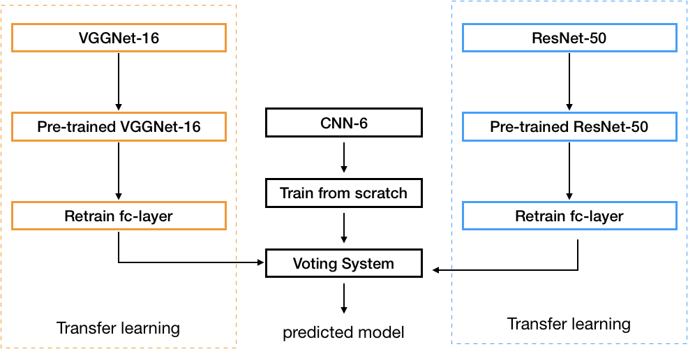

# Car Model Classification
This repository contains about deep learning project I did in open source software project lecture. I made the model combining three different type of convolutional neural networks. I have referred to the approach in this [article](https://www.mdpi.com/2078-2489/8/3/91).

# Architecture

I’ll use pre-trained VGG16 and ResNet50. All layers of these pre-trained models will be fine tuned and the last fully connected layers will be replaced entirely. CNN-6 will be trained from scratch.

# Dataset
The car dataset is from [Stanford Car Dataset](https://www.kaggle.com/jessicali9530/stanford-cars-dataset) contains 16,185 images of 196 classes of cars.

Train folder: 8144 images, avg: 41.5 images per class.

Test folder: 8041 images, avg: 41.0 images per class.

# Usage
### Requirments
-  python3
- torchvision
- GPU is recommended for training

## Training
Run the jupyter notebook file `our_proposal_model.ipynb`  
After training finished, the model will be saved in `/newModel.pt`

## Prediction
Place a car image you want to predict in `data/test_images.jpeg`.  
`newModel.pt` and `prediction.ipynb` must be placed in same directory.

Then, run `prediction.ipynb`

# Conclusion
|model|test acc|
|:---:|:---:|
|ResNet50|76.04|
|VGG16|79.88|
|Our proposal model|**82.07**|

This table is about best accuracy for each model during 30 epochs.  Our proposal model achieved better performance(82.07%) than RestNet50(76.04%) or VGG16(79.88%).

# Issues
- Our proposal model has shown improvment in test accuracy, but the training accuracy is about 99%. This can be considered as overfitting. 
- The weights of voting system are now arbitrary numbers. They should be modified accordingly.

